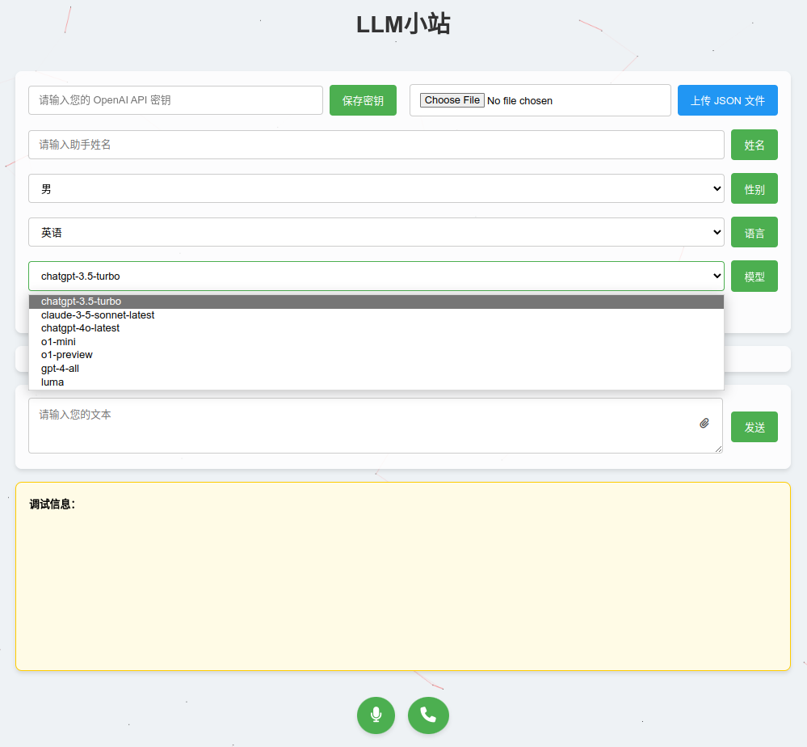
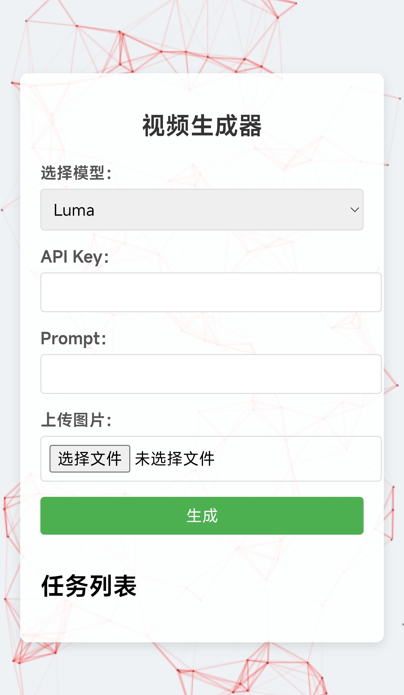
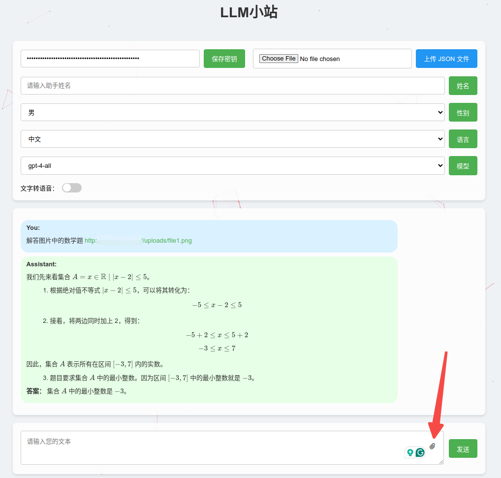
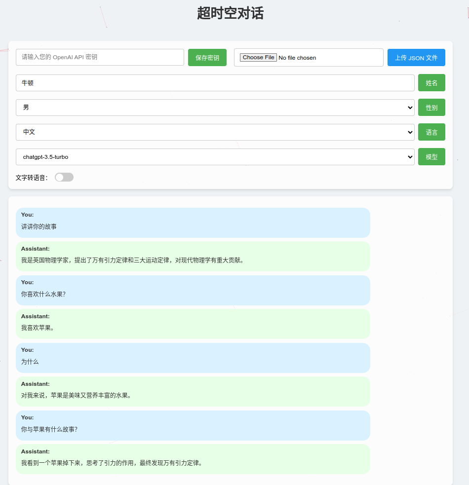

# LLM小站
(不用科学上网，不用编程，快速使用各种大模型)
- 前端页面拖入浏览器输入api-key即可使用，一分钟上手大模型
- openai-hub api + text2video + video2text (可以自行改成openai api)
- 使用各种大模型进行文本聊天、代码助手、语音聊天、实时通话、分析图片/文件、图片转视频
- 手机、电脑多端支持
- 调用openai-hub api，所有代码均由o1-preview/o1-mini完成。

  
  
  

## 1. 功能介绍
### 1.1 快速使用大模型
- 支持GPT3.5-Turbo、GPT4o、Claude-3.5、o1-mini、o1-preview、Luma ai、可灵、GEN3等，还可以自由集成其他api
- 支持文本聊天、语音聊天、文件上传

### 1.2 图片转视频
- 支持luma、可灵、GEN3,生成视频下载链接
### 1.3 语音接口（Talk with everyone）
- 输入任何人的名字，支持语音聊天，实时通话
- 给牛顿打电话

## 2. 使用方法
### 2.1 一分钟使用方法
- 将time_travel.html拖入浏览器即可访问大部分功能（除文件上传和图片转视频功能外的所有功能）
- 实测小米浏览器和safira可以流畅使用语音功能。edge和chrome需要授权麦克风权限，且chrome需要翻墙

### 2.2 标准使用方法
- 租赁或自己搭建LAMP环境，把time_travel文件夹或video文件夹上传到/var/www即可通过ip访问

